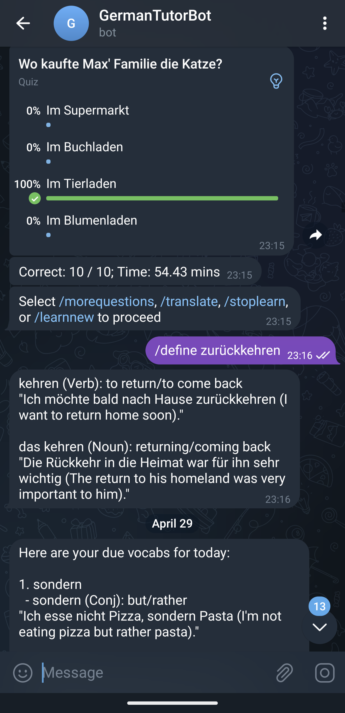

This project builds a Telegram Bot that helps users learn German using ChatGPT. It uses LangChain to talk with LLM providers.

Feel free to send pull requests or clone it for your own use.

# How to run?
Run it on Replit at: https://replit.com/@Nikasa1889/TelegramGermanTutorBot

You need to set the following secrets to talk with OpenAI API and Telegram:
  - OPENAI_API_KEY
  - TELEGRAM_BOT_TOKEN

To run it on your machine, set these secrets as your Environment variables and install these following dependencies:

```
python3 -m poetry add nltk pydantic openai langchain tiktoken python-telegram-bot
```

# What can the bot do?
- Help you learn a German text by:
  - Listing keywords and their meanings
  - Remember the keywords you care about and remind you to learn it later.
  - Generate Quiz to check your understanding
  - Generate random German text at A1/A2/B1 level
  - Translate side by side.
- Help you learn keywords you have seen:
  - Use Anki algorithm to schedule the learning.
  - Generate Quiz to check your vocabulary understanding.
- Send learning reminder daily

# Screenshots:





